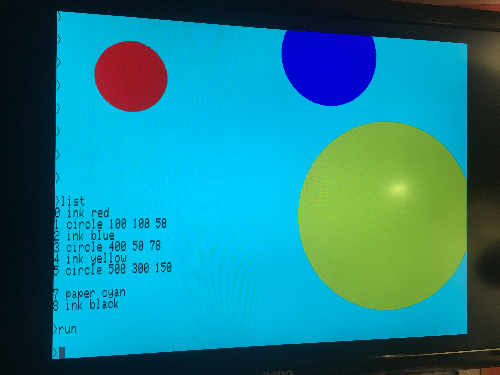

# smolBASIC

(formerly known as mi:little coder)

A very simple text-based programming language for the BBC micro:bit, written in Python.


## Tell me more, tell me more
smolBASIC runs on a micro:bit connected to any serial console via USB. The serial console can be the official micro:bit Python editor in a Chrome or Edge web browser.

smolBASIC could be a child's first text-based programming language, but it's also simple enough students can modify it themselves, for example adding instructions to show more images or access more sensors on the micro:bit or play more sounds. It could be used in KS3 in England to satisfy the requirement to teach a text-based language, and it could be accessible to more students than other, more complex languages.

Students could also translate the smolBASIC commands into other languages, to give younger students the opportunity to do some text-based coding in their mother tongue.

Its sheer simplicty also allows students to access some of the clarity of thought that comes with learning assembly language or machine code, but without having to learn hexadecimal, binary or memorise op codes.

As a first text-based langauge, it aims to be as simple as possible, so it avoids punctuation like quotation marks around strings or brackets that students find hard to type.

Programs have no line numbers when entered, but lines do have numbers when listed (mainly to allow 'goto' statements to work).

Every instruction takes half a second to execute. The slow pace allows students to think about how their programs work and what they do.

A student can simply type 
```
heart
pacman
ghost
run
```
and they have written and executed a text-based program and sequence without worrying about line numbers, capital letters or punctuation.

Despite being so simple, it lets you save smolBASIC programs to the micro:bit's non-volatile memory, so you don't lose your work (if you remember to save it!)

Read my initial blog post and watch the video here: http://www.suppertime.co.uk/blogmywiki/2021/07/simple-text-language/

## What's the instruction set?

Enter instructions and they don't run immediately as they would at a BASIC prompt or Python REPL. Instead they get stored in a program, which you then run by typing `run`

### LED display
Show images / icons just by typing their name, eg
```
heart
happy
sad
confused
meh
angry 
asleep
confused
yes
no
duck
small heart
pacman
ghost
skull
rabbit
diamond
small diamond
star
```

It's easy for students to add their own image instructions to the language.

Scroll text on the LED display with 
```
scroll hello world
```

You can clear the screen with `clear`

### Variables

You can have 26 variables. They have single letter names a - z.

Assign a variable with
```
a=23
```
Variables can be numerical or strings of characters.

You can put user input into a variable using
```
input b
```

Assign a random number between 1 and 99 to a variable with 
```
random a 99
```

### Maths operations
Maths operations can only be performed on variables and must be in the format `a=b*c`

Only +, -, / and * operators are supported.

### Branching and flow control

smolBASIC can branch conditionally with `if` and `goto` instructions:
```
if a>b goto 6
```

It supports <, > and = as operators.

Stop a program executing with
```
stop
```

There's no 'for' loop but you can create a loop by incrementing a variable and testing it, see the 'Loop' example below.

### Loops

smolBASIC has count-controlled loops. Looped sections of code start with `repeat` and end with `again` - so this example prints 'micro:bit is cool' 5 times then beeps:

```
0 repeat 5
1 print micro:bit is cool
2 again
3 beep A
```

### Editing and running programs

Delete the current program with `new`

You can delete line 3 with `del 3`

Edit line 3 by typing the line number and what you now want it to read, eg
```
3 happy
```

Run a program with `run`

Break out of a program with ctrl-C on the host computer.

### Sound
Play note A with
```
beep A
```
At the moment no note duration can be set.

### Fast and slow modes

By default every instruction takes half a second to excecute.

You can speed things up by typing `fast` at the prompt. This removes any delay. 

You can slow them back down again with `slow`


### Saving and loading programs

Save the current program to non-volatile memory with `save`

Restore the saved program with `load`

## Why 'smolBASIC'?
It's smoller than TinyBASIC.

## What you need to run it
- A BBC micro:bit V2 with built-in speaker (alas, it's now not smol enough to run on a V1)
- A micro USB cable
- A computer with either USB serial terminal software or access via Chrome or Edge web browsers to either the online micro:bit Python editor https://python.microbit.org/v/2 or the new alpha editor https://python.microbit.org/v/alpha or an online serial console like https://googlechromelabs.github.io/serial-terminal/

## How to start it up
- Flash the `smolBASIC.py` or .hex file to a BBC micro:bit V2
- Open a serial console, either the REPL in one of the micro:bit Python editors or any other serial console
- Type 'help' and press enter to see a list of instructions
- Type commands and run them!

## To-do list
There's lots I could add, but I don't want to add too much - it needs to be super-simple. For example, I know my Python is shonky and inconsistent, but if it's improved it still needs to be readable by a student new to Python.

- [ ] add access to sensors - perhaps assign them to variables, eg `a=light` or `b=temperature`
- [ ] read button state
- [ ] Add loops - a `repeat... again` construct
- [ ] add speech
- [ ] add a function to verify variable names and convert them to an index number
- [ ] Ability to parse expressions like a=b/17 - it may be a step too far, but I think the language needs to allow tasks like unit conversion. I have added the ability to do maths operations on variables.
- [ ] Consider changing paradigm so stored program lines have to be entered with a line number
- [ ] Consider direct execution of instructions
- [ ] Allow non-consecutive line numbers?
- [x] More general and better exception handling - at the moment if you trigger an exception, you lose your code (unless it's saved).

## Sample programs

### Voting age
```
0 print enter your age
1 input a
2 b=17
3 if a>b goto 6
4 print you are too young to vote
5 stop
6 print you can vote
```

### Guess the number 
```
0 random a 10
1 print guess my number 1-10
2 input b
3 if a=b goto 6
4 if a>b goto 8
5 if a<b goto 10
6 print correct!
7 stop
8 print too low!
9 goto 1
10 print too high!
11 goto 1
```

### Loop
This will count to 10.
```
0 a=1
1 b=1
2 c=11
3 print a
4 a=a+b
5 if a<c goto 3
```

## Original preview video

[](http://www.youtube.com/watch?v=xwxMju_L0hQ)]

## PiGFX version


Note that `smolBASIC-GFX-main.py` is an experimental and very buggy version that instead of using serial over USB, uses serial over pins on the edge connector so you can use a normal dumb terminal, such as a Raspberry Pi running PiGFX https://github.com/fbergama/pigfx



This version also has:
- `ink` and `paper` commands to set colours by name: red, green, blue, yellow, cyan, magenta, black and white. Ink also accepts numbers in the range 0-255 or variable names so you can create random colours. See https://upload.wikimedia.org/wikipedia/commons/1/15/Xterm_256color_chart.svg for a colour chart.
- `clear screen` clears the screen and sets colours back to black and white.
- `circle 20 30 40` draws a circle at x=20, y=30 with a radius of 40

Configure your PiGFX install (or other terminal) to run at 9600 baud. Connect a USB keyboard to the Pi and the Pi to a monitor via HDMI or composite video out (NTSC).

Connect micro:bit pin 1 to the UART TX pin on the Pi.

Connect micro:bit pin 2 to the UART RX pin on the Pi.

Connect micro:bit GND to Pi GND and micro:bit 3v to Pi 3v.

### Sample program to draw random colour and size circles

Sorry there's no break key, so save this before running. Enter fast mode, run it - then press the reset button on the micro:bit to break out of it.

```
0 random x 600
1 random y 400
2 random r 75
3 random c 255
4 ink c
5 circle x y r
6 goto 0
```

### Fix / to-do list

- [ ] Make paper take numbers and variables like ink
- [ ] Backspace needs to delete character if errors are corrected 
- [ ] Add more graphics (lines, rectangles)
- [ ] escape key to break? this may not be possible as `except KeyboardInterrupt:` doesn't work
- [ ] replace PiGFX font with custom cool font like Chicago
- [ ] rewrite whole parsing system to be more efficient
- [ ] consider a version with serial over USB instead of pins - requires more hardware but could greatly simplify code (input etc); I've tried this with a USB-serial adaptor used in reverse and it didn't work.
- [x] Allow circle to take variables as parameters
- [x] strip out stray spaces at ends of commands which cause errors
- [x] Input doesn't work
- [x] Add paper and ink colours
- [x] Add graphics (circle)
